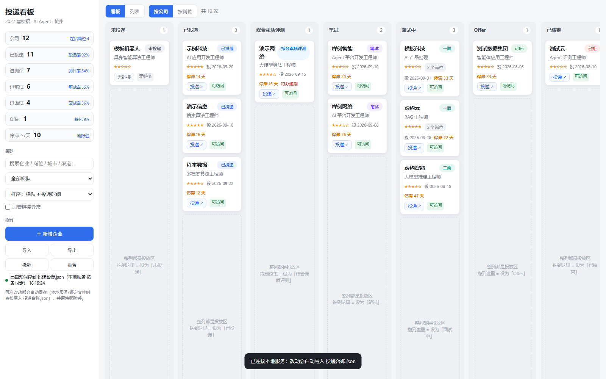
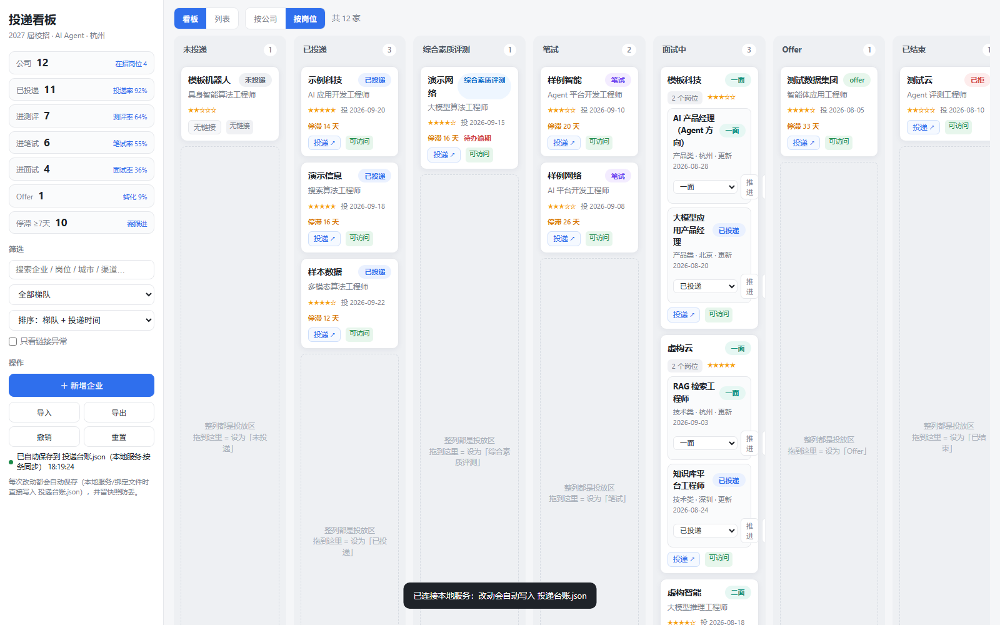
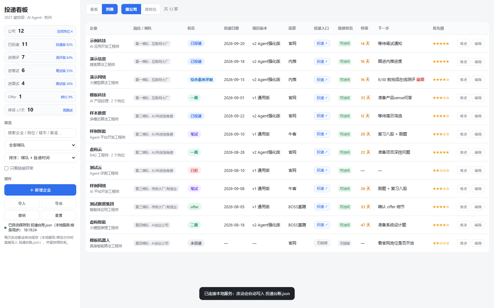

<div align="center">

# Job Tracker · 求职投递看板

**A local-first job-application tracker: kanban board, single-file frontend, zero-dependency Python server, and your data stays in a plain JSON file you own.**

[](https://www.python.org/)
[](server.py)
[](LICENSE)
[](tests/dashboard.test.js)
[](#why-this-exists)
[](README.md)
[](README.en.md)



</div>

---

> The UI is in Chinese (built for the Chinese campus-recruitment season). The code, API and data format are language-neutral — see [数据格式](README.md#数据格式) for the JSON schema.

## Why this exists

Tracking dozens of job applications in a spreadsheet doesn't work: which résumé version did I send, when, which interview round am I stuck at, and who should I follow up with?

Existing tools are either SaaS (your data on someone else's server), require sign-up, or are just a flat list with no pipeline view.

Four principles:

| Principle | How |
|---|---|
| **Your data is yours** | A single `data/ledger.json` — git-friendly, human-readable, portable |
| **Zero dependencies** | One HTML file for the frontend; Python stdlib only on the backend |
| **No data loss** | Per-record writes + write lock + atomic replace + pre-write backups + undo |
| **Works offline** | No network, no sign-up, no upload |

## Features

- **Kanban board** — 7 lanes (Not applied → Applied → Aptitude test → Written test → Interviewing → Offer → Closed); drop anywhere in a lane; auto-scroll while dragging; stale-days and overdue highlighting
- **List view** — search, tier filter, 5 sort modes, one-click "Apply ↗" links with reachability badges
- **Multiple positions per company** — per-position status/date/history, bulk paste parsing from a career page, grouped cards in "by position" view
- **Analytics** — funnel conversion rates, stale tracking, auto-recorded status history with drag-noise suppression
- **Safety** — undo (last 40 steps), import/export JSON, reset with automatic backup

## Quick start

Requires **Python 3.8+**. No pip install needed.

```bash
git clone https://github.com/<your-name>/job-tracker.git
cd job-tracker
python server.py
```

The browser opens at <http://127.0.0.1:8765/>. On first run the ledger is initialised from `data/sample-ledger.json` (12 fictional companies) — edit freely.

On Windows just double-click `start.bat`; on macOS/Linux run `./start.sh`.

```bash
python server.py --data my-ledger.json   # custom ledger path
python server.py --port 9000             # custom port
python server.py --no-browser            # don't open the browser
```

## Screenshots

**Board view** — drag to advance a stage


**By-position view** — multiple positions of one company merged into a single card



**List view** — search / filter / sort / link health



## Data & safety

| Mechanism | Detail |
|---|---|
| **Per-record writes** | Dragging a card rewrites only that record (`PUT /api/app/<id>`) — never the whole table |
| **Write lock** | Concurrent tabs/processes are serialised |
| **Atomic replace** | Write to `.tmp` then `os.replace` — no half-written files |
| **Pre-write backup** | Previous file copied to `data/.backup/` (last 50 kept) |
| **Undo** | Last 40 operations in the UI |
| **Conflict resolution** | On load, compares record count → progressed count → position count; the more complete side wins |

`data/ledger.json` and `data/.backup/` are gitignored — **your application data is never committed**.

## API

| Method | Path | Description |
|---|---|---|
| `GET` | `/` | Dashboard page |
| `GET` | `/api/state` | Full ledger (`X-File-Mtime` header = file mtime in ms) |
| `PUT` | `/api/app/<id>` | Create or update a single record |
| `DELETE` | `/api/app/<id>` | Delete a single record |
| `POST` | `/api/state` | Full replace (import / reset only) |

```bash
curl -X PUT http://127.0.0.1:8765/api/app/sample-001 \
  -H 'Content-Type: application/json' \
  -d '{"id":"sample-001","企业":"示例科技","投递状态":"笔试"}'
```

## Project layout

```
job-tracker/
├── dashboard.html            # single-file dashboard (UI + logic + fallback data)
├── server.py                 # local server (static page + per-record API, stdlib only)
├── start.bat / start.sh      # one-click launch
├── data/
│   ├── sample-ledger.json    # sample data (committable)
│   └── ledger.json           # your ledger (gitignored)
├── tools/                    # build-embed / check-links / sync-timeline
├── docs/                     # screenshots + architecture notes
└── tests/dashboard.test.js   # 100 regression tests (Node + DOM stubs, no browser)
```

## Development

```bash
npm test                          # node tests/dashboard.test.js
python -m py_compile server.py    # syntax check
```

Editing `dashboard.html` only requires a page refresh (the server reads it per request). Editing `server.py` requires a restart.

See [CONTRIBUTING.md](CONTRIBUTING.md) and [docs/ARCHITECTURE.md](docs/ARCHITECTURE.md).

## Design notes

- **Why not SQLite?** For a single user with a few hundred records, JSON's git diffability and portability outweigh SQLite's indexing/transaction advantages. The real risks — full-table overwrite and concurrent writes — are solved with per-record writes + a write lock + atomic replace.
- **Why is the on-disk file authoritative (not localStorage)?** localStorage is wiped by cache clearing, differs per browser, and can't go into git. It's demoted to an edit-time cache.
- **No automatic merging of same-name companies.** An earlier version auto-merged duplicates on load and silently dropped real position records (a real data-loss incident). Record counts are never changed automatically now.

## Roadmap

- [ ] Stats page (application pace, funnel trends)
- [ ] Interview question bank linked to debriefs
- [ ] Export to Excel / Feishu Bitable
- [ ] Dark mode
- [ ] Optional SQLite backend (for multi-device sync)

## License

[MIT](LICENSE) © job-tracker contributors
