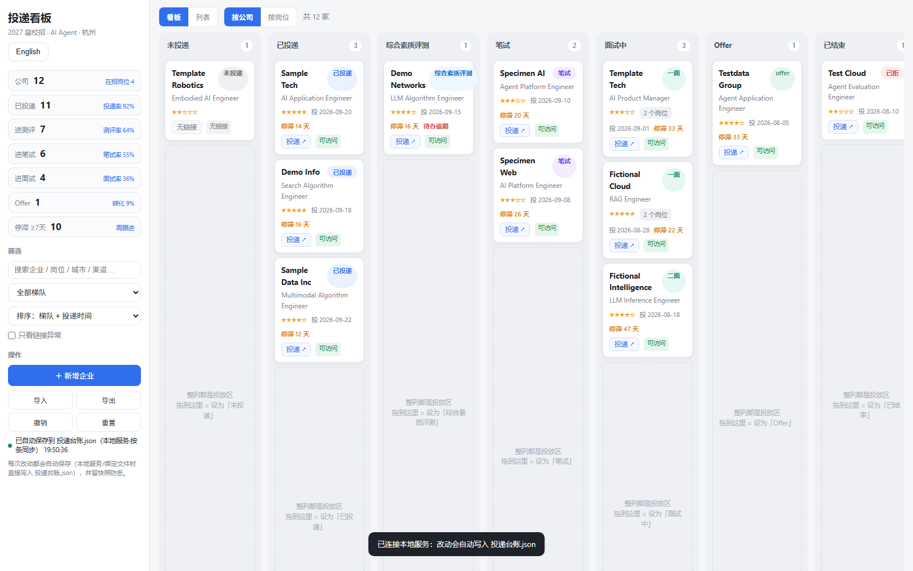
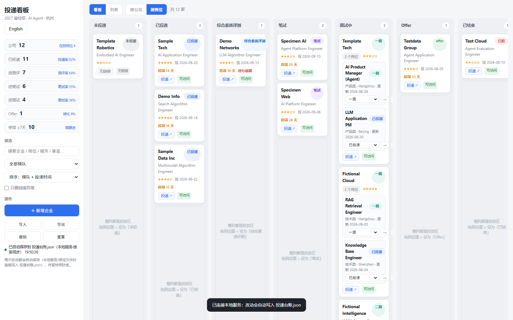
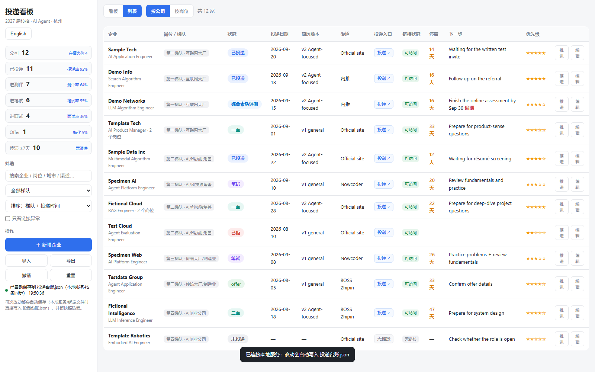

<div align="center">

[](README.en.md)
[](README.md)


# 求职投递看板 · Job Kanban

**一个把秋招投递管明白的本地工具：看板拖拽推进状态，数据是你自己的一份 JSON。**

**🟢 [在线试用](https://daetz-coder.github.io/job-kanban/) · [下载免安装版](https://github.com/daetz-coder/job-kanban/releases/latest)**

[](https://www.python.org/)
[](server.py)
[](LICENSE)
[](tests/dashboard.test.js)
[](#为什么做这个)



</div>

---

## 安装与获取

五种方式，按方便程度选。**任何一种都不会把你的数据上传到任何地方。**

| 方式 | 怎么做 | 需要什么 | 能自动写盘 |
|---|---|---|---|
| **在线版（PWA）** | 打开 <https://daetz-coder.github.io/job-kanban/> | 浏览器 | Chrome/Edge 可绑定本地文件 |
| **下载即用** | [Releases](../../releases) 下载 `job-kanban-windows.exe` · `-macos` · `-linux` | 无需 Python | ✅（写在程序同级目录） |
| **一行命令** | `uvx job-kanban` 或 `pipx run job-kanban` | Python 3.8+ | ✅ |
| **从源码运行** | `git clone … && python server.py` | Python 3.8+ | ✅ |
| **单文件** | [Releases](../../releases) 下载 `job-kanban-standalone.html` | 浏览器 | 导出 / 导入 JSON |

### 在线版 —— 可"安装"成应用，离线可用

打开链接后，用浏览器的 **安装应用**（手机上「添加到主屏幕」）：会有图标、全屏运行、离线可用。所有数据都在你自己的浏览器里，不上传。

**Chrome / Edge** 下点 **绑定本地文件**，之后每次改动都会直接写入你选的那个 JSON（和本地服务模式一样自动保存）；其他浏览器用导出 / 导入。

### 下载即用 —— 不用装 Python

到 [Releases](../../releases) 下载对应系统的可执行文件，双击运行，浏览器自动打开，台账会建在程序同级的 `data/ledger.json`。

```bat
job-kanban-windows.exe            :: Windows
./job-kanban-macos                :: macOS（未签名，首次需右键 → 打开）
./job-kanban-linux                :: Linux
```

### 一行命令 —— 给开发者

```bash
uvx job-kanban        # 或 pipx run job-kanban
job-kanban --port 9000 --data ~/my-ledger.json
```

### 从源码运行

```bash
git clone https://github.com/daetz-coder/job-kanban.git
cd job-kanban
python server.py
```

### 单文件 —— 最省事的形态

下载 `job-kanban-standalone.html`，双击打开即可。纯前端：数据存在浏览器本地，用 **导出 / 导入** 做备份。

> **界面语言**：默认**中文**（左上角一键切英文）。URL 加 `#en` 可强制英文——下面的截图就是英文界面。
> 数据字段与状态值始终是中文 schema，老台账继续可用，详见[数据格式](#数据格式)。

## 目录

- [安装与获取](#安装与获取)
- [为什么做这个](#为什么做这个)
- [功能](#功能)
- [快速开始](#快速开始)
- [界面预览](#界面预览)
- [数据与安全](#数据与安全)
- [项目结构](#项目结构)
- [配置](#配置)
- [API](#api)
- [数据格式](#数据格式)
- [配套工具](#配套工具)
- [开发](#开发)
- [常见问题](#常见问题)
- [设计取舍](#设计取舍)
- [路线图](#路线图)
- [贡献](#贡献)
- [License](#license)

---

## 为什么做这个

秋招投几十上百家，表格记不住：**投了哪版简历、什么时候投的、卡在哪一轮、哪家该跟进了**。用过的工具要么是 SaaS（数据在别人服务器）、要么要登录订阅、要么只能记流水账看不到全局。

这个工具的四条原则：

| 原则 | 落地方式 |
|---|---|
| **数据是你的** | 就是一份 `data/ledger.json`，能进 git、能随时打开看、能随便迁移 |
| **零依赖** | 前端一个 HTML 文件；后端只用 Python 标准库，不装任何包 |
| **不丢数据** | 按条写入 + 写锁 + 原子替换 + 写前备份 + 撤销 |
| **离线可用** | 不联网、不注册、不上传；断网照样用 |

## 功能

### 看板视图
- **7 条泳道**：未投递 → 已投递 → 综合素质评测 → 笔试 → 面试中 → Offer → 已结束
- **整列都是投放区**：拖到列里任意位置即可改状态，不必精确拖到卡片上
- **拖拽自动滚动**：拖到视口上下边缘自动滚动，长列不用先滚再拖
- 卡片直接显示：优先级星级、投递日期、**停滞天数**、待办逾期标红

### 列表视图
- 表格 + 搜索（企业 / 岗位 / 城市 / 渠道 / 备注）
- 梯队筛选、5 种排序（含「停滞最久」）
- 「投递 ↗」一键新标签打开投递页，并显示链接可访问性标记

### 一家公司多个岗位
- 每家公司可挂多个在招岗位，各自独立跟踪状态 / 日期 / 历史
- **批量粘贴**：直接粘贴招聘页复制的文本，自动解析出岗位名 / 类型 / 城市 / 在招业务 / 更新日期
- 「按岗位」视图把同一家公司**合并成一张分组卡**，卡内逐岗位改状态、推进、编辑
- 公司级状态 = 名下岗位最靠前的进度；投递日期取最早

### 质量与效率
- **漏斗统计**：投递率 / 测评率 / 笔试率 / 面试率 / Offer 转化率 / 停滞数
- **停滞提醒**：默认 7 天无进展高亮（`STALE_DAYS` 可调）
- **状态历史**：推进 / 拖拽 / 手改都自动留痕，且**来回拖动不产生噪音**（同日回退自动抵消）
- **撤销**：最近 40 步操作可回退
- 导入 / 导出 JSON、重置（均先自动备份）

## 快速开始

需要 **Python 3.8+**（不需要 pip 安装任何东西）。

```bash
git clone https://github.com/daetz-coder/job-kanban.git
cd job-kanban
python server.py
```

浏览器会自动打开 <http://127.0.0.1:8765/>。首次启动若没有台账文件，会**用示例数据初始化**（12 家虚构公司），随便改。

Windows 直接双击 **`start.bat`**；macOS / Linux 用 `./start.sh`。

```bash
# 常用参数
python server.py --data my-ledger.json   # 指定台账文件（可指向任意路径）
python server.py --port 9000             # 指定端口
python server.py --no-browser            # 不自动打开浏览器
python server.py --help
```

> **🟢 在线试用（已上线）**：<https://daetz-coder.github.io/job-kanban/> —— 零安装，打开即用；可「安装」成应用并离线使用，Chrome/Edge 下还能绑定本地 JSON 文件实现自动写盘。
> 该站点由 `.github/workflows/pages.yml` 在每次推送时自动发布。
>
> **不想起服务？** 直接双击 `dashboard.html` 也能用（纯前端模式：数据存在浏览器本地，可用「导出」存 JSON）。但**推荐用服务模式**——数据直接落盘到 JSON，不依赖浏览器缓存。

### 常用命令

```bash
make          # 查看所有命令
make run      # 启动服务
make check    # 一键完整检查（语法 + 前端测试 + 冒烟 + 安全）
make shots    # 重新生成 README 截图
```

## 界面预览

**看板视图**（拖拽推进状态，整列可投放）


**按岗位视图**（同一家公司多个岗位合并成一张卡，卡内逐岗位改状态）



**列表视图**（搜索 / 筛选 / 排序 / 链接可访问性）



## 数据与安全

数据默认在 `data/ledger.json`（缩进过的 JSON，`git diff` 能看清改了哪一条）。

| 机制 | 说明 |
|---|---|
| **按条写入** | 拖一张卡只重写那**一条**记录（`PUT /api/app/<id>`），不会整表覆盖 |
| **写锁串行** | 多标签页 / 多进程同时写也不会互相覆盖 |
| **原子替换** | 先写 `.tmp` 再 `os.replace`，不会出现半截文件 |
| **写前备份** | 每次写入前把旧文件存进 `data/.backup/`（保留最近 50 份） |
| **撤销** | 界面上可回退最近 40 步 |
| **冲突判定** | 打开时比较「记录数 → 有进度数 → 岗位数」，更完整的一方为准，残缺的浏览器缓存不会覆盖磁盘数据 |

`data/ledger.json`、`data/.backup/` 已在 `.gitignore` 中忽略——**你的投递数据不会被提交到仓库**。

建议把台账放进你自己的**私有** git 仓库定期提交，这样连历史版本都有了：

```bash
cd /path/to/your-private-repo
cp /path/to/job-kanban/data/ledger.json .
git add ledger.json && git commit -m "投递进度 2026-10-04"
```

## 项目结构

```
job-kanban/
├── dashboard.html            # 看板（单文件：界面 + 逻辑 + 兜底数据）
├── manifest.webmanifest      # PWA 清单（可安装、离线可用）
├── sw.js                     # Service Worker（缓存外壳，绝不缓存 /api）
├── server.py                 # 仓库入口（薄垫片）
├── src/job_kanban/           # 服务实现（可安装的 Python 包）
├── packaging/                # PyInstaller spec + 打包资源暂存
├── start.bat / start.sh      # 一键启动（Windows / macOS·Linux）
├── Makefile                  # 常用命令（run / test / check / shots / clean）
├── data/
│   ├── sample-ledger.json    # 示例数据（12 家虚构公司，可提交）
│   └── ledger.json           # 你的台账（gitignore）
├── tools/
│   ├── build-embed.py        # 把 JSON 内嵌进 dashboard.html
│   ├── check-links.py        # 批量检测投递链接可访问性
│   ├── sync-timeline.py      # 生成 Markdown 时间线视图
│   └── screenshot.py         # 用 headless Chrome 重新生成 README 截图
├── docs/                     # 截图、图标、架构说明、自定义指南
└── tests/
    ├── dashboard.test.js     # 124 项回归测试（Node + DOM 桩，无需浏览器）
    ├── smoke_test.py         # 14 项服务冒烟测试（跨平台，无需 bash/curl）
    ├── safety_check.py       # 8 项开源安全与隐私检查（含 README 语言与死链）
    ├── cjk_check.py          # 守卫：默认中文，且英文界面不得含中文
    └── packaging_check.py    # 6 项分发自检（入口 / 冻结路径 / 版本一致）
```

## 配置

| 配置项 | 位置 | 默认 |
|---|---|---|
| 数据文件路径 | `--data` | `data/ledger.json` |
| 端口 | `--port` | `8765` |
| 是否自动开浏览器 | `--no-browser` | 自动打开 |
| 停滞提醒天数 | `dashboard.html` 里 `const STALE_DAYS` | `7` |
| 状态流转阶段 | `dashboard.html` 里 `const PIPELINE` | 见「数据格式」 |
| 备份保留份数 | `server.py` 里 `KEEP_BACKUPS` | `50` |

## API

| 方法 | 路径 | 说明 |
|---|---|---|
| `GET` | `/` | 看板页面 |
| `GET` | `/api/state` | 整份台账（响应头 `X-File-Mtime` 为文件修改时间毫秒） |
| `PUT` | `/api/app/<id>` | 新增或更新**单条**记录（不存在则追加） |
| `DELETE` | `/api/app/<id>` | 删除**单条**记录 |
| `POST` | `/api/state` | 整份替换（仅导入 / 重置使用） |

```bash
# 示例：把某家公司的状态改成「笔试」
curl -X PUT http://127.0.0.1:8765/api/app/sample-001 \
  -H 'Content-Type: application/json' \
  -d '{"id":"sample-001","企业":"示例科技","投递状态":"笔试"}'
```

## 数据格式

```jsonc
{
  "meta": {
    "状态可选值": ["未投递", "已投递", "综合素质评测", "笔试", "一面", "二面", "三面", "HR面", "offer", "已拒", "放弃"]
  },
  "applications": [
    {
      "id": "sample-001",              // 稳定标识，新增时自动生成
      "企业": "示例科技",
      "梯队": "第一梯队-互联网大厂",
      "岗位": "AI 应用开发工程师",
      "工作地点": "杭州 / 北京",
      "投递链接": "https://example.com/campus",
      "投递状态": "已投递",
      "投递日期": "2026-09-20",
      "简历版本": "v2 Agent强化版",
      "渠道": "官网",
      "内推": "",
      "优先级": 5,                      // 1-5
      "下一步": "等待笔试通知",
      "下一步截止": "",
      "备注": "",
      "岗位列表": [],                   // 一家公司多个在招岗位
      "面试记录": [],                   // [{日期, 轮次, 结果, 备注}]
      "状态历史": []                    // [{日期, 从, 到, 备注}]，自动追加
    }
  ]
}
```

字段可随意增删——看板只依赖上面这些键，**多出来的字段会原样保留**（可以放心加「薪资范围」「联系人」等自定义列）。

## 配套工具

```bash
python tools/check-links.py      # 批量检测投递链接可访问性，写回「链接状态」字段
python tools/sync-timeline.py    # 生成 timeline.md（状态速览 + 投递时间线 + 待投递清单）
python tools/build-embed.py      # 把 JSON 内嵌进 dashboard.html（改了兜底数据时用）
python tools/screenshot.py       # 用 headless Chrome 重新生成 README 截图
```

`check-links.py` 把结果分三类，避免误判：`可访问` / `真问题·404|域名解析失败` / `待确认·环境受限|SSL证书|超时`。在能正常上网的机器上运行最准。

`screenshot.py` 会用**示例数据**起一个临时服务并截图，不会碰到你的真实台账，输出到 `docs/`。

## 开发

```bash
make check                        # 一键完整检查（语法 + 前端 + 冒烟 + 安全 + CJK + 打包）
npm test                          # 前端回归测试（124 项）
npm run test:smoke                # 服务冒烟测试（14 项）
npm run test:safety               # 开源安全与隐私检查（5 项）
npm run test:cjk                  # 英文界面不得含中文（需 Chrome）
npm run test:packaging            # 分发形态自检（6 项）
```

- 改 `dashboard.html` 后**刷新页面即可**（服务每次请求实时读取文件，不用重启）
- 改了 `server.py` 需重启服务
- 测试用最小 DOM 桩直接执行页面脚本，**不需要浏览器**；断言与数据量无关，示例数据也能跑

想改状态阶段、统计口径、自定义字段、主题色？见 **[自定义指南](docs/CUSTOMIZATION.md)**。
架构与设计取舍见 **[docs/ARCHITECTURE.md](docs/ARCHITECTURE.md)**；贡献流程见 **[CONTRIBUTING.md](CONTRIBUTING.md)**。

## 常见问题

<details>
<summary><b>数据存在哪？会丢吗？</b></summary>

权威数据是磁盘上的 `data/ledger.json`（不是浏览器缓存）。每次写入前自动备份到 `data/.backup/`（保留 50 份），界面上还能撤销最近 40 步。浏览器 localStorage 只当编辑态缓存。
</details>

<details>
<summary><b>为什么不用 SQLite？</b></summary>

单人、几百条数据，SQLite 的索引 / 连接 / 聚合收益很小；而 JSON 能直接进 git、能人工 diff、能随时打开看。真正的数据风险来自「整表覆盖」和「并发写」——这两点用**按条写入 + 写锁 + 原子替换**就解决了，不必换存储引擎。详见 [设计取舍](#设计取舍)。
</details>

<details>
<summary><b>能多台电脑同步吗？</b></summary>

把 `data/ledger.json` 放进你自己的私有 git 仓库，两台机器 `git pull/push` 即可。工具本身不联网，不做云同步。
</details>

<details>
<summary><b>能改状态阶段吗？（比如加「群面」「AI 面试」）</b></summary>

可以。改 `dashboard.html` 里的 `const PIPELINE` 和 `const BOARD`，看板列、推进按钮、进度条、拖拽、统计会全线自动生效。
</details>

<details>
<summary><b>拖拽没反应 / 卡片拖不动？</b></summary>

「按公司」视图的公司卡可拖拽；「按岗位」视图的分组卡**故意不可拖拽**（一家公司多个岗位时，拖整张卡语义不明），改为卡内下拉框逐岗位改状态。
</details>

<details>
<summary><b>端口被占用怎么办？</b></summary>

`python server.py --port 9000`。若提示已被占用，通常说明已经有一个实例在跑，直接开网址即可。
</details>

<details>
<summary><b>中文乱码？</b></summary>

数据文件是 UTF-8。Windows 控制台若显示乱码，用支持 UTF-8 的编辑器（VS Code / 记事本）打开即可，不影响数据。
</details>

## 设计取舍

**为什么前端是单文件**：双击即用、无构建步骤、便于 fork 与二次修改。代价是 HTML 里含一份「兜底数据」，改数据后需跑 `tools/build-embed.py`。

**为什么权威数据在磁盘而不是 localStorage**：localStorage 会被清缓存、换浏览器、换电脑清掉，且无法进 git。把它降级为编辑态缓存，磁盘 JSON 才是真相。

**为什么冲突时「更完整的一方」优先**：曾出现浏览器里残缺的旧状态把磁盘上完整数据覆盖的情况。现在按「记录数 → 有进度数 → 岗位数」比较，磁盘更完整时一律以磁盘为准。

**为什么不做自动合并同名公司**：曾尝试「同名公司自动合并」，结果把用户真实岗位记录当作重复项丢弃（真实事故）。现在**绝不自动改动记录数**，合并类操作一律交给用户显式确认。

## 路线图

- [ ] 数据统计页（投递节奏、转化漏斗趋势）
- [ ] 面试题库与复盘记录联动
- [ ] 导出 Excel / 飞书多维表格
- [ ] 深色模式
- [ ] 可选的 SQLite 后端（面向多端同步场景）

欢迎在 [Issues](../../issues) 提需求。

## 贡献

欢迎 PR 与 Issue。提交前请：

1. `npm test` 全绿
2. 不引入运行时第三方依赖（前端零依赖、后端仅标准库是核心设计）
3. 数据相关改动必须考虑**向后兼容**与**不丢数据**

详见 [CONTRIBUTING.md](CONTRIBUTING.md)。

## License

[MIT](LICENSE) © job-kanban contributors

<div align="center">

如果这个工具帮你把秋招管明白了，给个 ⭐ 让更多人看到。

</div>
